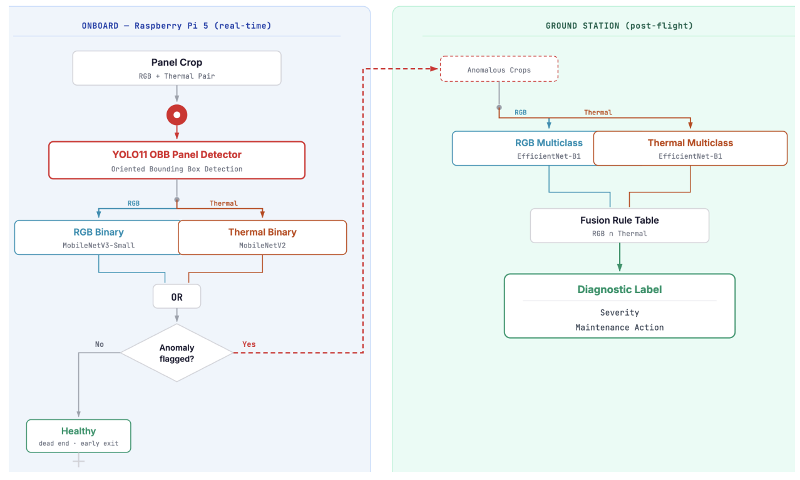

# UAV-Based Photovoltaic Panel Inspection

RGB-thermal sensor fusion and deep learning for fault classification, deployed as a cascaded edge pipeline on a Raspberry Pi 5.

This repository contains the full implementation of my Engineering thesis (PFE), conducted at **CRTI (Centre de Recherche en Technologies Industrielles)** under the supervision of **Hamdane Bensenane** (supervisor) and **Kechida Ahmed** (co-supervisor).

## Overview

The system inspects photovoltaic panels from a UAV, using synchronized RGB and thermal imagery to detect and classify faults (soiling, shadowing, burns/discoloration, structural damage, and thermal hotspots) in real time, entirely on-board a Raspberry Pi 5. A ground station receives the fused results, GPS-tagged, over a live video/telemetry link.



## Pipeline

The system runs as a cascaded, multi-stage pipeline:

1. **Panel detection** — YOLO11n-OBB (oriented bounding boxes), exported to NCNN INT8 (5.17 MB, mAP50 0.860, 7.6 FPS on-device).
2. **Thermal two-stage cascade** :
   - *RGB binary triage* — MobileNetV3-Small (ONNX Runtime, FP16) flags anomaly vs. no-anomaly per detected panel (~95.9% accuracy, ~96.6% anomaly recall, ~27 ms/inference).
   - *RGB multiclass* — EfficientNet-B1 (TFLite, float16) classifies flagged panels into 5 classes: No Anomaly, Soiling/Pollution, Shadowing/Vegetation, Burn/Discoloration, Structural Damage (95.7% test accuracy).
3. **Thermal two-stage cascade**:
   - *Stage 1* — MobileNetV2 binary classifier (anomaly vs. no-anomaly, TFLite float16, ~23 ms, AUC 0.993).
   - *Stage 2* — EfficientNet-B1 3-class classifier (hotspot / partial cold / full cold), triggered only when Stage 1 flags an anomaly (focal loss γ=2.0; AUC 0.997 / 0.986 / 0.979).
4. **Fusion** — deterministic 8-label rule table combining RGB and thermal outputs into a final fault verdict (field binary triage agreement rate: 43.1%).
5. **Geolocation** — GPS fixes are Kalman-filtered and HDOP-weighted (~2–3 m CEP), tagging each detected fault with a precise location.
6. **Streaming & ground station** — live RTSP video (via `mediamtx`) and telemetry streamed to the RC/ground station, with a dashboard for live inference monitoring.

## Repository structure

```
.
├── docs/                    # architecture & data flow diagrams
├── datasets/                # dataset prep, cleaning, and annotation scripts
├── models/                  # training notebooks, exported weights, results
│   ├── panel_detection/
│   ├── rgb_binary/
│   ├── rgb_multiclass/
│   ├── thermal_binary/
│   └── thermal_multiclass/
├── fusion/                  # RGB-thermal fusion rule engine
├── edge_pipeline/           # code running on-board the Raspberry Pi 5
│   ├── gps_correction/
│   ├── inference/
│   └── streaming/
├── ground_station/          # ground station pipeline + monitoring dashboard
│   └── dashboard/
├── field_tests/             # end-to-end and stress test scripts
└── data.yaml                # dataset configuration
```

## Hardware setup

- **Compute**: Raspberry Pi 5, onboard the UAV
- **RGB camera**: `/dev/video2`
- **Thermal camera**: TOPDON TC002C Duo
- **GPS**: u-blox NEO-7M, UBX binary protocol, SBAS/EGNOS enabled, airborne dynamic model, on `/dev/ttyAMA0`
- **Link**: H16 remote control network, directional WiFi for image/telemetry transfer


## Datasets

- **RGB**: unified 5-class taxonomy built from four public sources (Detect_solar_dust, Faulty_solar_panel, Solar_Panel_Defect_2, solar_panel_fault_detection), with CLAHE preprocessing and augmentation.
- **Thermal**: merged from PVF-10 (InfraredSolarModules) and PVMD, with hue-jitter augmentation for palette invariance.
- **Panel detection**: 600 manually annotated images (oriented bounding boxes).

## Results at a glance

| Stage | Model | Metric |
|---|---|---|
| Panel detection | YOLO11n-OBB (NCNN INT8) | mAP50 0.860 · 7.6 FPS |
| RGB binary triage | MobileNetV3-Small (ONNX FP16) | 95.92% acc · 96.63% recall |
| RGB multiclass | EfficientNet-B1 (TFLite FP16) | 95.7% acc (5-class) |
| Thermal binary | MobileNetV2 (TFLite FP16) | AUC 0.993 |
| Thermal multiclass | EfficientNet-B1 (TFLite FP16) | AUC 0.997 / 0.986 / 0.979 |
| Fusion (field) | Rule-based | 43.1% agreement rate |

## Documentation

- Full PFE report link : [https://drive.google.com/file/d/1ppqHY43MOECyJ6D2CNpxvP5j7JuL79dy/view?usp=sharing]
- Presentation link : [https://drive.google.com/file/d/1I87jeCAsjDLx1BN7RON0hS_0Z4a7RrfA/view?usp=sharing]

## Authors

**Chellal Aicha** — Engineering degree, Computer Systems Engineering (Intelligent and Autonomous Systems), ESI-SBA
Supervised by Hamdane Bensenane · Co-supervised by Kechida Ahmed
